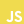

<h2 align="center">About Me</h2>

```python
class YevhenMartynenko:
    def __init__(self):
        self.name = "Yevhen Martynenko"
        self.title = "Python Backend Developer"
        self.stack = ["Django", "DRF", "Flask"]
        self.skills = ["REST APIs", "Scalable Web Apps", "Cybersecurity"]
        self.contacts = {
            "LinkedIn": "https://www.linkedin.com/in/yevhenmartynenko/",
            "GitHub": "https://github.com/yevhen-martynenko",
            "Gmail": "yevhen.martynenko.v@gmail.com",
            "ProtonMail": "yevhen.martynenko@proton.me",
            "Telegram": "@martinyev",
        }

    def about(self):
        return (
            """
            I'm a Python Developer specializing in backend development with 
            Django, DRF, and Flask.
            
            I focus on writing readable code, building strong APIs, and keeping
            things fast and secure.
            
            I've been using Linux for over four years using Arch-based systems.
            My daily driver is Manjaro with Sway WM and Neovim.
            
            Currently building SaaS projects and improving my skills by taking
            online courses like Harvard's CS50.
            
            I'm open to new opportunities and collaboration.
            """
        )
```


<h2 align="center">Contacts</h2>

[](https://www.linkedin.com/in/yevhenmartynenko/)
[](https://t.me/martinyev)
[](https://github.com/yevhen-martynenko)
[](mailto:yevhen.martynenko.v@gmail.com)
[](mailto:yevhen.martynenko@proton.me)

- [View My CV](./assets/Backend_Developer_YevhenMartynenko_CV.pdf)
- [Personal Website](https://yevhen-martynenko.github.io)
- Gmail: <a href="mailto:yevhen.martynenko.v@gmail.com">yevhen.martynenko.v@gmail.com</a>
- ProtonMail: <a href="mailto:yevhen.martynenko@proton.me">yevhen.martynenko@proton.me</a>


<h2 align="center">Languages</h2>

<!------- Language levels ------->
<!-- A1 - Beginner -->
<!-- A2 - Elementary -->
<!-- B1 - Intermediate -->
<!-- B2 - Upper-Intermediate -->
<!-- C1 - Advanced -->
<!-- C2 - Proficient -->
<!-- Native -->
<div style="display: flex; align-items: flex-start; align: center">
<table align="center">
  <tr>

    🇬🇧 English - B2 Upper Intermediate

  </tr>
  <tr>

    🇺🇦 Ukrainian - Native

  </tr>
  <tr>

    🇷🇺 Russian - Native

  </tr>
</table>
</div>


<h2 align="center">Stack and Tools</h2>

<!-- Icons: https://devicon.dev -->
<!-- Icons: https://simpleicons.org/ -->
##### Languages:
<div style="display: flex; align-items: flex-start; align: center">
<table align="center">
  <tr>
    <td align="center" width="88">
      
      <br>Python
    </td>
    <td align="center" width="88">
      
      <br>JavaScript
    </td>
    <td align="center" width="88">
      
      <br>TypeScript
    </td>
    <td align="center" width="88">
      
      <br>C
    </td>
  </tr>
</table>
</div>

##### Frameworks & Libraries:
<div style="display: flex; align-items: flex-start; align: center">
<table align="center">
  <tr>
    <td align="center" width="88">
      
      <br>DRF
    </td>
    <td align="center" width="88">
      
      <br>Django
    </td>
    <td align="center" width="88">
      
      <br>NumPy
    </td>
    <td align="center" width="88">
      
      <br>Pytest
    </td>
    <td align="center" width="88">
      
      <br>Flask
    </td>
  </tr>
</table>
</div>

##### Frontend:
<table align="center">
  <tr>
    <td align="center" width="88">
      
      <br>HTML5
    </td>
    <td align="center" width="88">
      
      <br>CSS3
    </td>
    <td align="center" width="88">
      
      <br>SASS
    </td>
    <td align="center" width="88">
      
      <br>Webpack
    </td>
  </tr>
</table>

##### Databases:
<table align="center">
  <tr>
    <td align="center" width="88">
      
      <br>SQLite
    </td>
    <td align="center" width="88">
      
      <br>MySQL
    </td>
    <td align="center" width="88">
      
      <br>MariaDB
    </td>
    <td align="center" width="88">
      
      <br>PostgreSQL
    </td>
  </tr>
</table>

##### Tools:
<table align="center">
  <tr>
    <td align="center" width="88">
      
      <br>Linux
    </td>
    <td align="center" width="88">
      
      <br>Bash
    </td>
    <td align="center" width="88">
      
      <br>Git
    </td>
    <td align="center" width="88">
      
      <br>Docker
    </td>
    <td align="center" width="88">
      
      <br>Swagger (OpenAPI)
    </td>
    <td align="center" width="88">
      
      <br>Nginx
    </td>
    <td align="center" width="88">
      
      <br>Gunicorn
    </td>
  </tr>
</table>
